# Tutorial Git
1. Creamos un repositorio nuevo en github vacío.

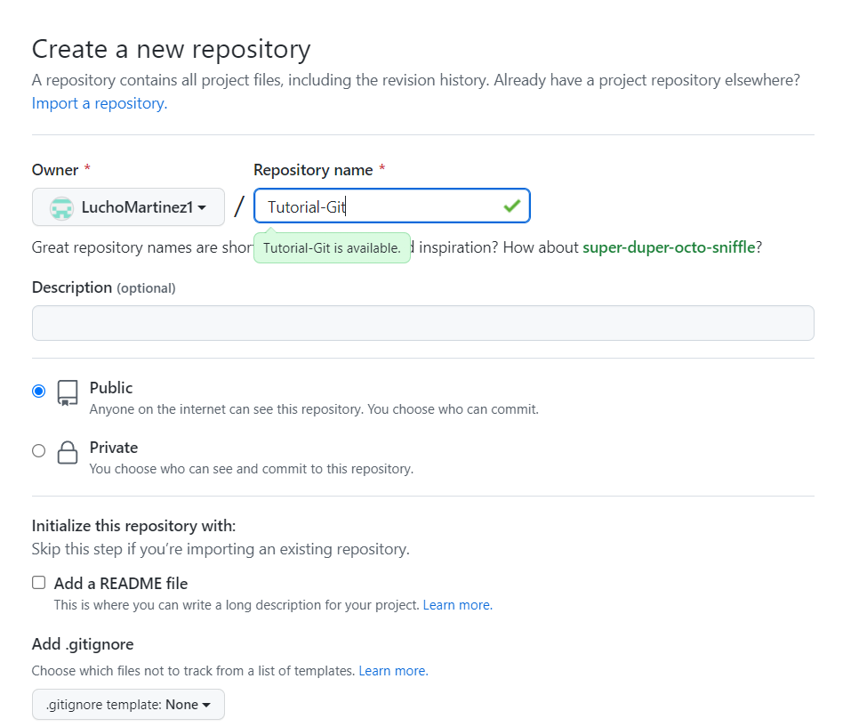

2. Creamos un proyecto nuevo en intellij y trabajamos en él (ésta vez lo hice sin iniciar un repositorio de Git).

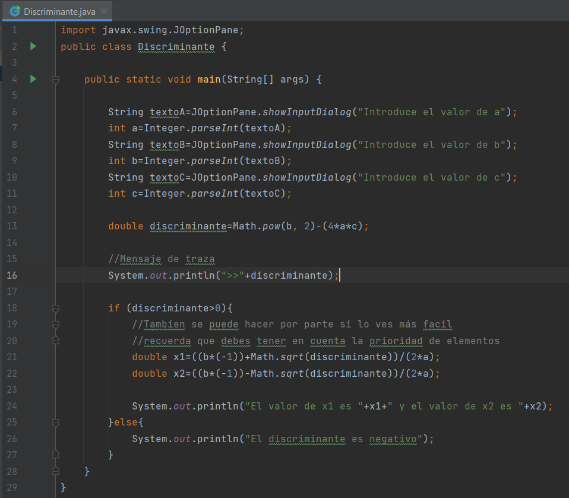

3. Creamos una carpeta para guardar las capturas del tutorial y poder tener las imágenes para este README.md.

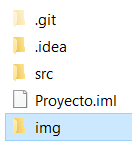

4. Inicializamos un repositorio de Git en local y vemos el estado del repositorio.

```bash
git init
```

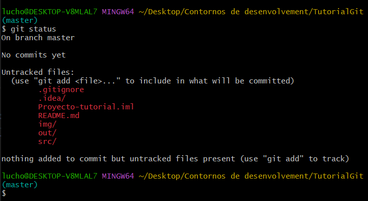

5. El siguiente paso es ignorar en el "working directory" las carpetas que no nos interesan subir: .idea/ y out/. Para esto creo un nuevo documento con el nombre .gitignore.

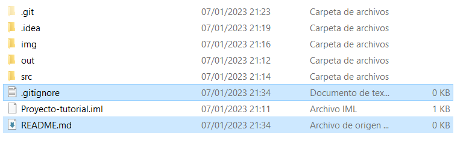

En él añadiremos las carpetas (".../") o archivos ("*.txt") que no queremos que sean trackeadas cada vez que pusheamos, ya que sino tendríamos que hacerlo de forma manual cada vez que querramos hacer un commit con el siguiente comando (antes de commitear):

```bash
git rm -r --cached .idea/
```

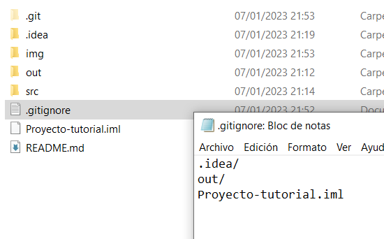

Ahora nos toca ver el estado del repo tras haber modificado el .gitignore.

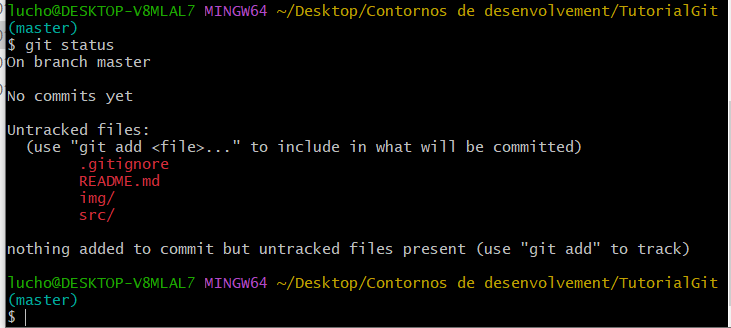

6. Como vemos en el paso anterior, añado también este README creando un documento de texto al cual también le cambio la extensión y le llamo README.md y voy editando en Visual Studio Code.

7. Ahora si estamos listos para commitear:
    - Lo primero es añadir los cambios del working directory al staging área:

    ```bash
    git add .
    ```
    - Commiteamos, siempre con mensaje

    ```bash
    git commit -m "subiendo proyecto con README y .gitignore"
    ```

8. Nos olvidamos de cambiar el README.md en el commit anterior, esto se soluciona con el siguiente comando (para cualquier cambio):

```bash
git commit --amend --no-edit
```
Si no quiero cambiar el mensaje del commit que quiero añadir o modificar algo.

```bash
git commit --amend -m "..."
```
Si le quiero cambiar el mensaje.

9. Para verificar que el cambio se ha realizado sobre el mismo commit, o ver el historial de commits del proyecto tenemos el siguiente comando:

```bash
git log --oneline
```

Este es un log antes del amend:

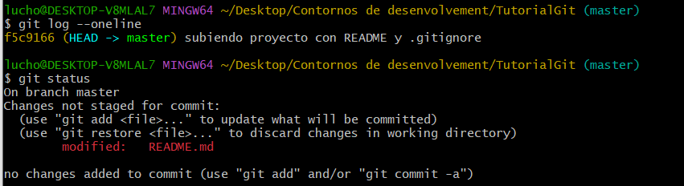

Luego del amend:

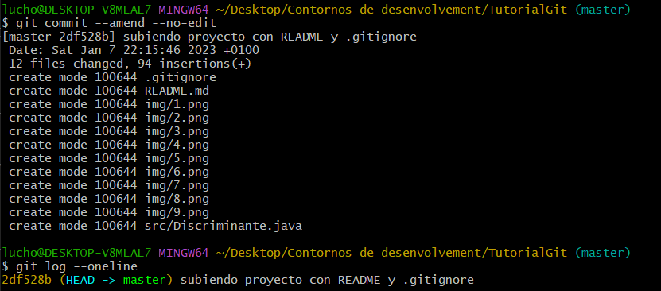

Como vemos, cambia el hash del commit.    

10. Pusheamos el proyecto por primera vez.

    1. Sincronizamos con el repo remoto.

    ```bash
    git remote add origin (URL github)
    ```
    2. Subimos:

    ```bash
    git push -u origin master
    ```

11. Ahora simularemos que queremos seguir con el proyecto desde otro terminal creando una rama nueva.

   - Lo primero que tenemos que hacer es clonar el proyecto desde github al local:

    ```bash
    git clone https://github.com/LuchoMartinez1/Git-Tutorial.git
    ```

   - Creamos una rama para hacer un cambio o desarrollar en Intellij:

    ```bash
    git checkout -b change-code
    ```

    "chekout" para salir de master y "-b" (branch) para crear la rama nueva. 

   - Modificamos el código tal como se ve en el commit.

   - Nos preparamos para hacer merge a master.

   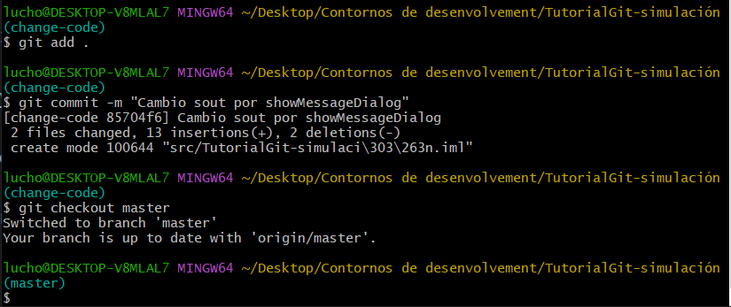

   - Realizamos el merge sin conflictos.

   ```bash
    git merge change-code
   ```

   - Por último avanzo en este README (commiteo) y pusheo ambas ramas, en este caso no hace falta añadir el remoto ya que se sincroniza al hacer el clone.

   ```bash
    git push -u origin --all
   ```

12. Cuando volvemos a nuestro local debemos ejecutar el siguiente comando:

```bash
git fetch
```
Este comando nos da la información del repositorio remoto descargando sus archivos sin modificar nuestro local:

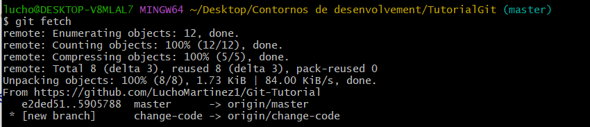

Vemos que nuestro local está por detrás, para seguir trabajndo en el proyecto sin que surgan conflictos al volver a hacer push primero debemos descargar los que hemos avanzado desde el otro terminal, esto se hace con:

```bash
git pull
```

En una situación normal este pull lo haría sin problemas y ya podríamos seguir trabajando sobre nuestra rama master, sin embargo en mi caso al ir creando este README paso a paso y modificarlo sobre la marcha ya he hecho un cambio en local sin hacer antes el pull, por lo tanto al intentar hacer el pull pasa lo siguiente:

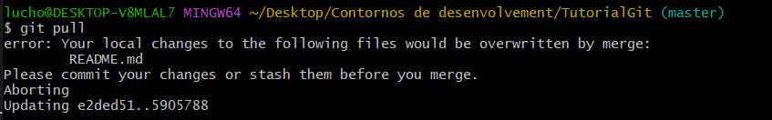

Lo que vamos a hacer es commitear para así generar un conflicto. 

Volvemos a hacer git pull, y entramos en estado de MERGING, el git status ahora muestra lo siguiente:

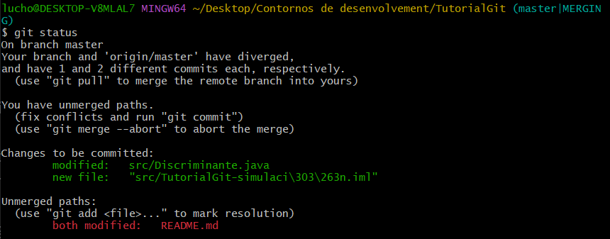

Solucionamos el conflicto en el README y hacemos git status:

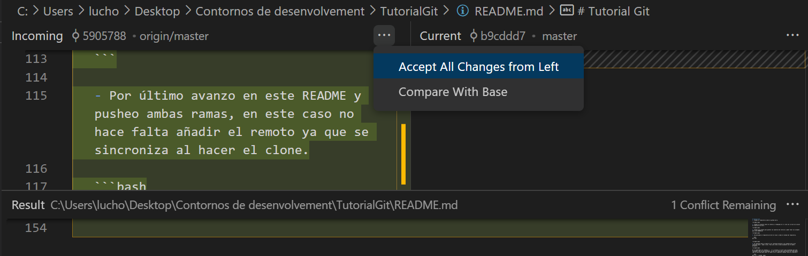

Estamos listos para añadir los cambios al stage, hacer el commit y subir nuevamente el proyecto con nuestro avance.

